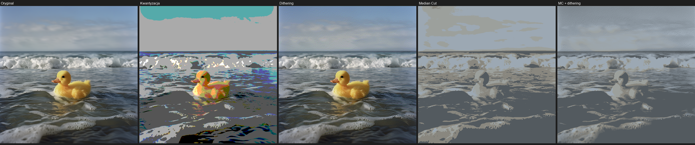
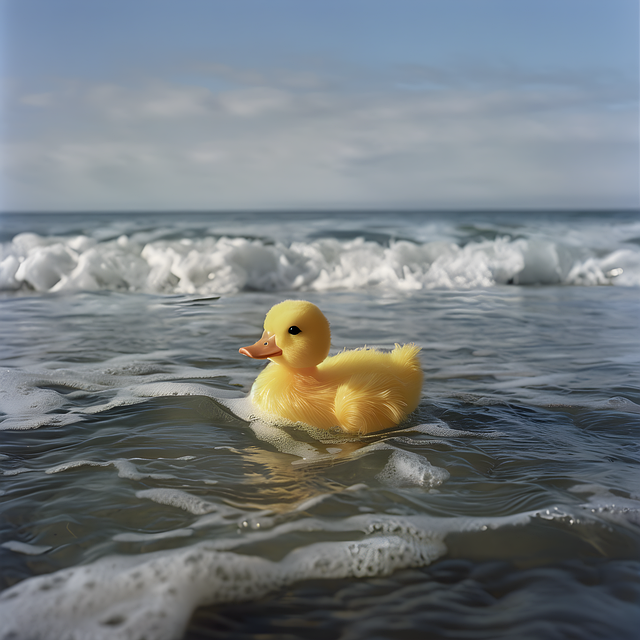
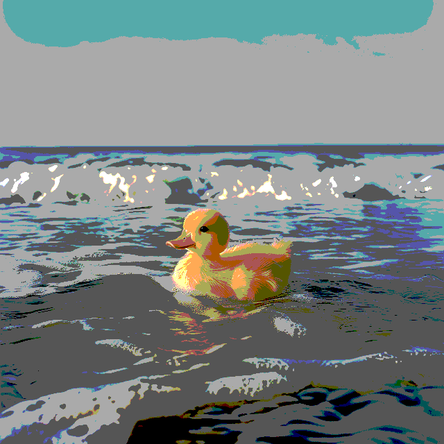
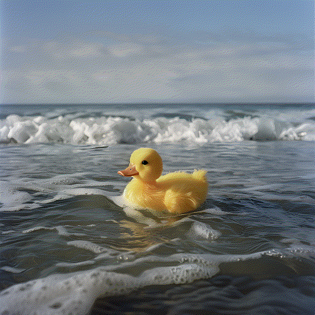
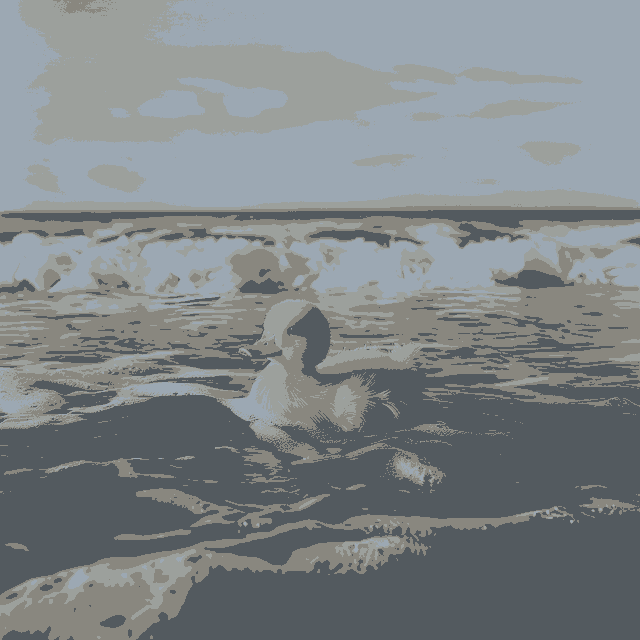
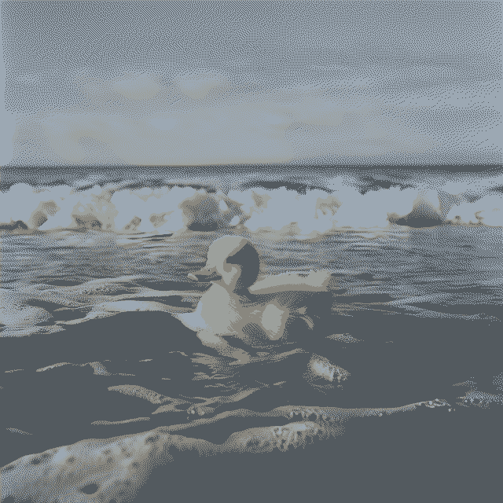

# Redukcja kolorów i dithering — aplikacja Flask

Aplikacja webowa będąca częścią **pracy inżynierskiej**. Porównuje metody redukcji liczby kolorów w obrazach cyfrowych oraz ocenia jakość wyników metryką SSIM.

## Przykład działania

Poniżej wynik przetwarzania przykładowego obrazu przy poziomie redukcji `4`.

### Porównanie wszystkich metod



| Metoda | Liczba kolorów | SSIM (vs oryginał) | Co widać |
|--------|----------------|--------------------|----------|
| Oryginał | ~74 925 | 1.0000 | Pełna paleta, gładkie przejścia |
| Kwantyzacja | 26 | 0.6937 | „Plakatowy” efekt, ostre pasy kolorów |
| Dithering (Floyd–Steinberg) | 39 | 0.2951 | Ziarnista tekstura, optycznie bliżej oryginału |
| Median Cut | 4 | 0.7475 | Adaptacyjna paleta, duże płaskie obszary |
| Median Cut + dithering | 4 | 0.3843 | Ta sama paleta, gładsze przejścia dzięki ditheringowi |

> **Uwaga:** SSIM nie zawsze oddaje wrażenie wizualne — dithering często wygląda lepiej niż czysta kwantyzacja mimo niższej wartości SSIM.

### Poszczególne wyniki

| Oryginał | Kwantyzacja | Dithering |
|:---:|:---:|:---:|
|  |  |  |

| Median Cut | Median Cut + dithering |
|:---:|:---:|
|  |  |

Przykładowe obrazy znajdują się w folderze [`examples/`](examples/).

## Co zawiera projekt

### Algorytmy przetwarzania obrazu
- **Kwantyzacja (uniform quantization)** — równomierna redukcja kolorów w kanałach RGB
- **Dithering (Floyd–Steinberg)** — rozpraszanie błędu kwantyzacji dla lepszego wrażenia wizualnego
- **Warianty z szumem** — opcjonalne dodanie szumu przed kwantyzacją / ditheringiem
- **Median Cut** — adaptacyjna minimalizacja palety kolorów
- **Median Cut + dithering** — połączenie obu podejść

### Porównanie jakości
- Liczenie liczby unikalnych kolorów w obrazie
- Porównanie obrazów wynikowych z oryginałem metryką **SSIM** (Structural Similarity Index)

### Interfejs webowy (Flask)
- Upload obrazu przez przeglądarkę
- Suwak poziomu redukcji kolorów
- Opcja dodania szumu
- Podgląd wyników: oryginał, kwantyzacja, dithering, Median Cut, Median Cut + dithering
- Wyświetlenie SSIM oraz liczby kolorów dla każdej metody

## Struktura plików

```
flaskProject/
├── app.py                                  # Aplikacja Flask (routing, upload, porównania)
├── rRedukcja_i_dithering_1sposob.py        # Kwantyzacja + dithering Floyd–Steinberg
├── rRedukcja_i_dithering_1sposob_i_szum.py # To samo z opcjonalnym szumem
├── rMedianCut_i_dithering_2sposob.py       # Median Cut + Median Cut z ditheringiem
├── aPrownanie.py                           # Porównanie SSIM
├── ileKolorow.py                           # Zliczanie unikalnych kolorów
├── examples/                               # Przykładowe wyniki do README
├── templates/                              # Szablony HTML
│   ├── index.html                          # Formularz wczytywania obrazu
│   ├── indexv2.html                        # Wyniki wszystkich metod
│   └── indexv3.html                        # Dodatkowy widok porównania
├── static/uploads/                         # Tła UI + zapisane obrazy
└── requirements.txt
```

## Wymagania

- Python 3.10+
- Zależności z `requirements.txt` (Flask, Pillow, NumPy, scikit-image)

## Uruchomienie

```bash
cd flaskProject
python -m venv .venv

# Windows
.\.venv\Scripts\Activate.ps1

# Linux / macOS
source .venv/bin/activate

pip install -r requirements.txt
python app.py
```

Aplikacja będzie dostępna pod adresem: [http://127.0.0.1:5000](http://127.0.0.1:5000)

## Jak korzystać

1. Otwórz stronę główną
2. Wybierz obraz do przetworzenia
3. Ustaw poziom redukcji kolorów suwakiem
4. Opcjonalnie zaznacz dodanie szumu
5. Prześlij formularz i porównaj wyniki metod oraz wartości SSIM

## Autor

Praca inżynierska — [DawidKaczy](https://github.com/DawidKaczy)
